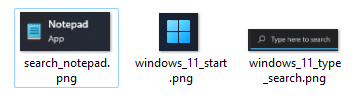

Sikulix Automation
------------------

**Sikulix Automation** is a simple RPA (robotic process automation) program which interacts with UI by clicking at specified elements on a screen and typing texts. 

This program is written in Java and is using [SikuliX](http://www.sikulix.com/) library.

Program is reading configuration from ``config.json`` file by default.

You may specify alternate configuration file as first argument.

```
java -jar sikulix-automation.jar config.json
```

## Usage ##

Create JSON file ``config.json`` and execute program with ``java -jar`` command.

Scenario section defines base path for image files and array of steps to take.

### ``config.json`` ###

```json
{
  "verbose": "true",
  "scenario": {
    "name": "Hello",
    "steps": [
      {
        "print": "Hello, World!"
      },
      {
        "wait": "3",
        "print": "Goodbye, cruel world."
      },
      {
        "wait": "3"
      }
    ]
  }
}
```

Above example will simply print text with little delay. 

```
Playing scenario Hello
Hello, World!
Goodbye, cruel world.
```

More complex example is on the way.

### ``config.json`` ###

```json
{
  "verbose": "true",
  "scenario": {
    "path": "C:/EXAMPLE/Scenario/",
    "steps": [
      {
        "click": "windows_11_start.png"
      },
      {
        "mouse": "RIGHT"
      },
      {
        "wait": "1.5"
      },
      {
        "click": "windows_11_type_search.png"
      },
      {
        "wait": "1.5"
      },
      {
        "type": "notepad"
      },
      {
        "wait": "1.5"
      },
      {
        "click": "search_notepad.png"
      },
      {
        "wait": "1.5"
      },
      {
        "message": "Hello, World"
      },
      {}
    ]
  }
}
```

Alternatively scenario file can be defined in separate ``scenario.json`` file.

### ``config.json`` ###

```json
{
  "play": "scenario.json"
}
```

### ``scenario.json`` ###

```json
{
  "scenario": {
    "steps": [
      {
        "print": "Hello, World."
      }
    ]
  }
}
```

The same scenario can be written in script file.

### ``scenario.script`` ###

```
PRINT Hello, World.
```

Scenario file can be set without file extension, program will try to find valid json or script file.

### ``config.json`` ###

```json
{
  "play": "scenario"
}
```

Images used to recognize UI elements to click in should be located in current working directory or specified by ``path`` in ``scenario`` section.



Every step may contain one or more elements from the list below.

 - click
 - type
 - mouse
 - message
 - wait

### click ###

Click inside UI element specified by image.

```json
{
  "click": "windows_start.png"
}
```

### wait ###

Wait for specified time in seconds.

```json
{
  "wait": "1.5"
}
```

### type ###

Type text.

```json
{
  "text": "notepad"
}
```

### mouse ###

Click down and up mouse button. Possible values are: "LEFT", "RIGHT", "MIDDLE".

```json
{
  "mouse": "RIGHT"
}
```

### message ###

Display message dialog.

```json
{
  "message": "Hello, World."
}
```

## Scripting ##

Instead of using scenario in JSON it is possible to create script file and point to it ore more than one in ``config.json``.

```json
{
  "play": "scenario"
}
```

### ``scenario.script``

```
DELAY 0.5
LABEL 10
PATH C:/EXAMPLE/Scenario/
CLICK windows_11_start.png
MOUSE RIGHT
WAIT 0.5
MOUSE UP
WAIT 1.5
CLICK windows_11_type_search.png
WAIT 1.5
TYPE notepad
WAIT 1.5
CLICK search_notepad.png
WAIT 1.5
MESSAGE "Hello, World"
JUMP 10
```

## Build ##

Use [Apache Maven](https://maven.apache.org/) to build project.

```
mvn -T 1C package
```
